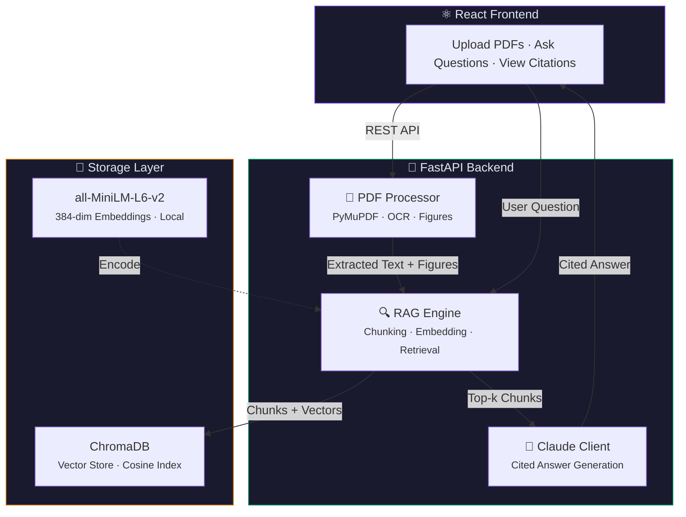

<div align="center">


<br><br>

# 🧠 ScholarMind

### AI-Powered Research Assistant with Retrieval-Augmented Generation

*Upload scientific papers. Ask questions in natural language. Get cited answers with page references — zero hallucinations.*

<br>

[Features](#-features) · [Architecture](#-architecture) · [Quick Start](#-quick-start) · [How It Works](#-how-it-works) · [Tech Decisions](#-technical-decisions) · [API Reference](#-api-reference) · [Docs](docs/)

<br>

---

</div>

<br>

## ✨ Features

<table>
<tr>
<td width="50%">

**📄 Smart PDF Processing**
- Text extraction with PyMuPDF
- Figure & table detection
- OCR fallback for scanned papers
- Title extraction via font-size heuristic

</td>
<td width="50%">

**🔍 Semantic Search**
- Section-aware chunking (Abstract, Methods, Results...)
- 384-dim embeddings via sentence-transformers
- Cosine similarity retrieval from ChromaDB
- Metadata-rich results with relevance scores

</td>
</tr>
<tr>
<td width="50%">

**🤖 Cited AI Answers**
- Claude Sonnet generates grounded responses
- Every claim tagged with `[Paper, Page]`
- No hallucination — answers only from your papers
- Cross-paper synthesis and comparison

</td>
<td width="50%">

**💻 Modern Interface**
- Drag-and-drop PDF upload
- Real-time processing status
- Expandable citation cards
- Paper selection for targeted search

</td>
</tr>
</table>

<br>

## 🏗 Architecture



<br>

## 📋 How It Works

```
┌─────────┐    ┌──────────┐    ┌──────────┐    ┌──────────┐    ┌──────────┐    ┌──────────┐
│ 1.UPLOAD │───▶│ 2.EXTRACT│───▶│ 3.CHUNK  │───▶│ 4.EMBED  │───▶│ 5.STORE  │    │          │
│   PDF    │    │Text+Figs │    │ Section  │    │ 384-dim  │    │ ChromaDB │    │          │
└──────────┘    └──────────┘    │  Aware   │    │ Vectors  │    └────┬─────┘    │          │
                                └──────────┘    └──────────┘         │          │          │
┌──────────┐    ┌──────────┐    ┌──────────┐                         │          │          │
│ 8.ANSWER │◀───│7.GENERATE│◀───│6.RETRIEVE│◀────────────────────────┘          │          │
│  Cited   │    │  Claude  │    │  Top-k   │◀───────────────────────────────────│ 6.QUERY  │
│ Response │    │  Sonnet  │    │ Semantic │                                    │  User Q  │
└──────────┘    └──────────┘    └──────────┘                                    └──────────┘
```

| Step | Component | What Happens |
|:----:|-----------|-------------|
| **1** | Upload | PDF file received by FastAPI server |
| **2** | Extract | PyMuPDF pulls text per page, detects figures (base64), finds tables. OCR fallback via Tesseract for scanned pages |
| **3** | Chunk | Section-aware splitter detects academic headers (Abstract, Methods, Results...) and creates 512-word overlapping chunks |
| **4** | Embed | Each chunk encoded into 384-dim vector using `all-MiniLM-L6-v2` (runs locally, zero API cost) |
| **5** | Store | Vectors + metadata (paper ID, page number, section, figure refs) indexed in ChromaDB with cosine similarity |
| **6** | Query + Retrieve | User question is embedded → top-k similar chunks retrieved with relevance scores |
| **7** | Generate | Retrieved chunks sent to Claude Sonnet with structured prompt enforcing `[Paper, Page]` citation format |
| **8** | Answer | Cited response returned to frontend with expandable source cards |

<br>

## 🔬 Sample Interaction

```
📄  Uploaded: underwater_litter_detection.pdf
    12 pages · 47 chunks · 3 figures extracted

❓  User: What deep learning architectures were compared in this study?

🤖  ScholarMind:

    The study evaluated two instance segmentation architectures for underwater
    marine litter detection:

    1. Mask R-CNN with a ResNet-101-FPN backbone, using domain-adapted training
       with AdamW optimizer, differential learning rates, and gradient clipping
       [Paper: underwater_litter_detection.pdf, Page: 4]

    2. Mask2Former with a Swin Transformer backbone, representing a more recent
       query-based approach to instance segmentation
       [Paper: underwater_litter_detection.pdf, Page: 5]

    Both models were evaluated on a custom COCO-format dataset containing ~8,000
    annotated underwater images across 10 marine litter categories. The Mask R-CNN
    variant achieved ~62-65% mean Dice coefficient and ~56-59% mean IoU.
    [Paper: underwater_litter_detection.pdf, Page: 8]

    📎 Sources (3) ▾
```

<br>

## 🚀 Quick Start

### Prerequisites

| Tool | Version | Purpose |
|------|---------|---------|
| Python | 3.10 – 3.13 | Backend runtime |
| Node.js | 18+ | Frontend tooling |
| API Key | [AICredits.in](https://aicredits.in) or [Anthropic](https://console.anthropic.com) | LLM access |

### 1. Clone and setup backend

```bash
git clone https://github.com/Lalitaditya-tickoo/ScholarMind.git
cd ScholarMind/backend

python -m venv venv
source venv/bin/activate          # Windows: venv\Scripts\activate
pip install -r requirements.txt

# Configure your API key
cp .env.example .env
# Edit .env → ANTHROPIC_API_KEY=sk-live-your-key

python main.py
# ✅ "ScholarMind backend ready!" (first run downloads ~90MB embedding model)
```

### 2. Start frontend (new terminal)

```bash
cd ScholarMind/frontend
npm install
npm run dev
# ✅ http://localhost:5173
```

### 3. Use it

1. Open `http://localhost:5173` in your browser
2. Drag-drop research papers (PDF) into the sidebar
3. Wait for processing (10-30s per paper)
4. Ask questions → get cited answers

<br>

## ⚖️ Technical Decisions

| Decision | Chose | Over | Rationale |
|----------|:-----:|------|-----------|
| **Vector DB** | ChromaDB | Pinecone, Weaviate | Zero config, local, free, persistent. No network latency for a single-user research tool |
| **Embeddings** | all-MiniLM-L6-v2 | OpenAI ada-002 | Runs locally (₹0 cost), 384-dim sufficient for academic text, top-tier MTEB scores for its size |
| **PDF Parser** | PyMuPDF | pdfplumber, PyPDF2 | 10x faster extraction, supports images + font metadata, handles multi-column layouts |
| **Chunking** | Section-aware + overlap | Fixed-size, recursive | Respects paper structure — a Methods chunk won't bleed into Results. 64-word overlap prevents boundary information loss |
| **LLM** | Claude Sonnet | GPT-4o, local LLMs | Best citation compliance, strong long-context synthesis, ~₹0.15–0.30 per query |
| **Frontend** | React + Tailwind | Streamlit, Gradio | Portfolio-grade UI with full control. Streamlit/Gradio produce generic interfaces |

> 📖 Deep dive: [docs/technical-decisions.md](docs/technical-decisions.md)

<br>

## 📡 API Reference

| Method | Endpoint | Description |
|:------:|----------|-------------|
| `POST` | `/papers/upload` | Upload and process a PDF → returns metadata + chunk count |
| `GET` | `/papers` | List all uploaded papers with stats |
| `DELETE` | `/papers/{id}` | Remove paper and its vectors from the store |
| `POST` | `/query` | Ask a question → returns cited answer + sources |
| `POST` | `/papers/{id}/summarize` | Generate structured summary (Objective, Methods, Findings) |
| `GET` | `/health` | System health + vector store statistics |

<details>
<summary><b>Example: Query Request</b></summary>

```json
POST /query
{
  "question": "What methodology did they use for data collection?",
  "paper_ids": null,
  "top_k": 8
}
```

**Response:**
```json
{
  "answer": "The study employed a systematic...",
  "citations": [
    {
      "paper_id": "a1b2c3",
      "paper_name": "methods_paper.pdf",
      "page_number": 4,
      "chunk_text": "Data was collected using...",
      "relevance_score": 0.8923
    }
  ],
  "figures_used": []
}
```

</details>

<br>

## 📁 Project Structure

```
ScholarMind/
├── backend/
│   ├── main.py              # FastAPI server — upload, query, delete, summarize
│   ├── pdf_processor.py     # PDF extraction: text, figures, tables, OCR
│   ├── rag_engine.py        # Chunking, embedding, ChromaDB, retrieval
│   ├── claude_client.py     # Claude API via OpenAI-compatible gateway
│   ├── models.py            # Pydantic schemas
│   └── requirements.txt
├── frontend/
│   ├── src/
│   │   ├── App.jsx          # Main app: upload, chat, citations, paper list
│   │   ├── main.jsx         # React entry
│   │   └── index.css        # Tailwind + custom styles
│   ├── index.html
│   └── package.json
├── docs/
│   ├── how-rag-works.md     # Conceptual RAG explainer
│   └── technical-decisions.md
└── README.md
```

<br>

## ⚠️ Limitations & Roadmap

| Current Limitation | Planned Improvement |
|--------------------|-------------------|
| Figures extracted but not sent to LLM for visual analysis | Integrate direct Anthropic API for Claude Vision support |
| Tables detected but not structurally parsed | Add Camelot/tabula-py for row-column extraction |
| LaTeX equations extracted as raw text | Integrate LaTeX-to-text converter |
| Single-user local deployment | Dockerize + deploy with auth for multi-user access |
| English-only section detection | Multilingual header patterns |

<br>

## 📚 Learn More

- [How RAG Works — Conceptual Guide](docs/how-rag-works.md) — Full explanation of the retrieval-augmented generation pipeline
- [Technical Decisions](docs/technical-decisions.md) — Engineering trade-offs and component selection rationale

<br>

## 🛠 Built With

<p>


</p>

<br>

---

<div align="center">

**Built by [Lalitaditya](https://github.com/Lalitaditya-tickoo)** · CS Undergrad (AI/ML) · SRM University

*Research: Underwater marine litter instance segmentation · Interests: Computer vision, deep learning, RAG systems*

</div>
