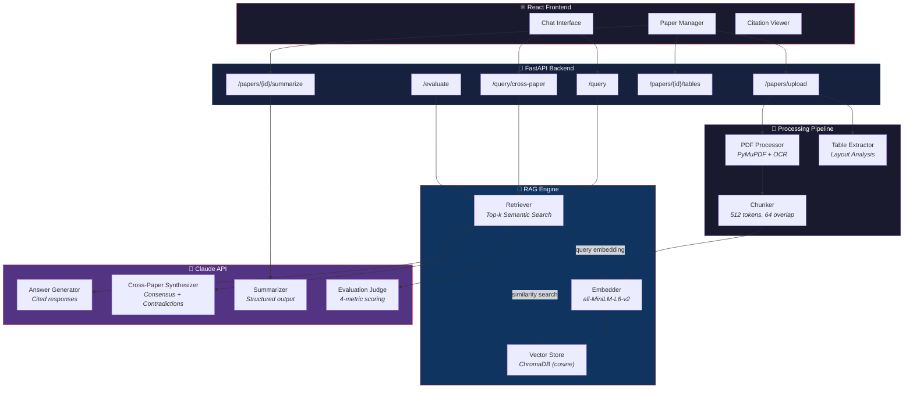
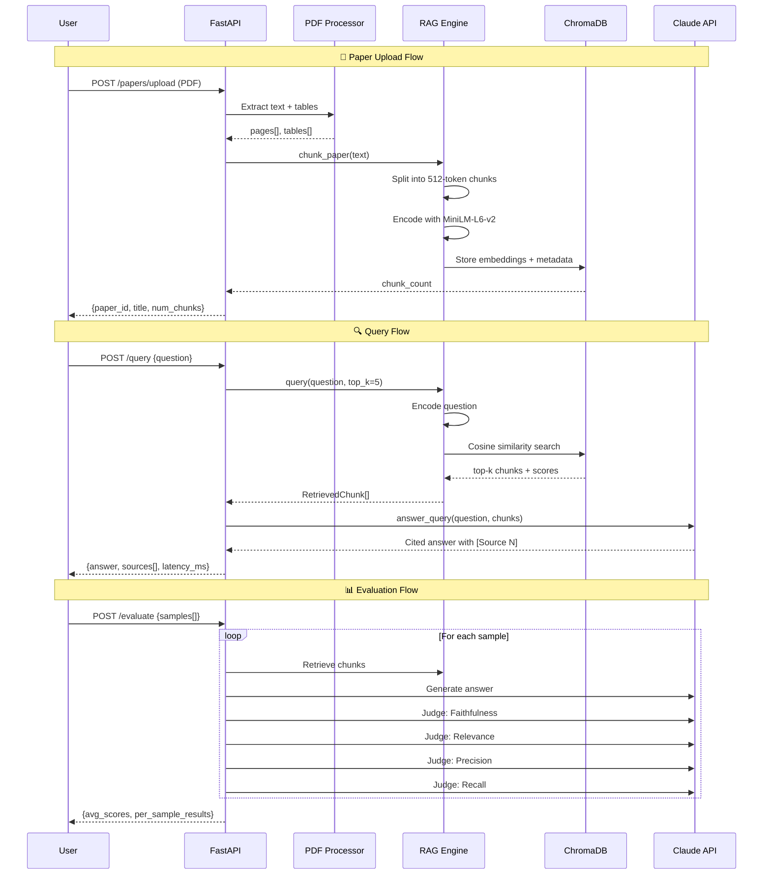
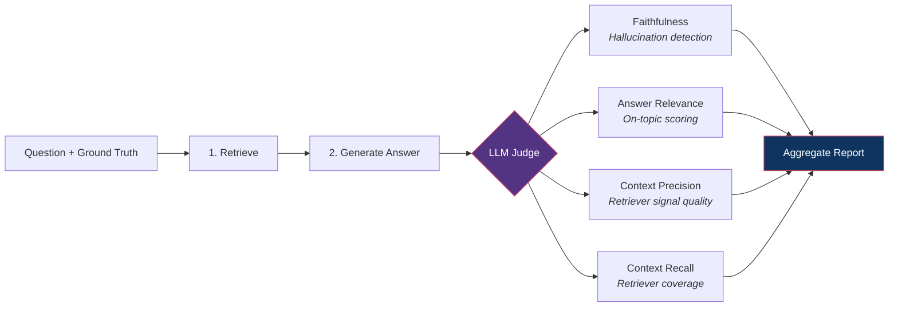

<div align="center">

# 🧠 ScholarMind

### AI-Powered Research Assistant with Quantified RAG Evaluation

**Upload papers → Ask questions → Get cited answers → Measure quality**

[](https://python.org)
[](https://fastapi.tiangolo.com)
[](https://react.dev)
[](https://anthropic.com)
[](https://www.trychroma.com)

<br>

*Not just another RAG demo — ScholarMind includes a **RAGAS-inspired evaluation pipeline**, **cross-paper synthesis**, and **table extraction** that quantify and differentiate the system from typical retrieval-augmented generation projects.*

---

</div>

## What Makes This Different

| Feature | Typical RAG Project | ScholarMind |
|---------|-------------------|-------------|
| **Query answering** | Upload → retrieve → answer | ✅ With inline source citations |
| **Evaluation** | "It works" | ✅ 4-metric RAGAS pipeline (Faithfulness, Relevance, Precision, Recall) |
| **Multi-paper analysis** | Query one paper at a time | ✅ Cross-paper synthesis: consensus, contradictions, research gaps |
| **Table extraction** | Ignores tables entirely | ✅ Structured table parsing with Markdown export |
| **Summarization** | Generic summary | ✅ Structured: Objective → Methods → Findings → Limitations |

---

## Architecture



---

## RAG Pipeline Deep Dive



---

## API Reference

| Method | Endpoint | Description |
|--------|----------|-------------|
| `POST` | `/papers/upload` | Upload and process a PDF → returns metadata + chunk count |
| `GET` | `/papers` | List all uploaded papers with stats |
| `DELETE` | `/papers/{id}` | Remove paper and its vectors from the store |
| `POST` | `/query` | Ask a question → returns cited answer + sources |
| `POST` | `/query/cross-paper` | **Cross-paper synthesis** → consensus, contradictions, gaps |
| `POST` | `/papers/{id}/summarize` | Generate structured summary (Objective, Methods, Findings) |
| `GET` | `/papers/{id}/tables` | **Extract tables** from a paper's PDF |
| `POST` | `/evaluate` | **Run RAGAS-style evaluation** on the RAG pipeline |
| `GET` | `/health` | System health + vector store statistics |

<details>
<summary><b>📨 Example: Query Request & Response</b></summary>

```bash
curl -X POST http://localhost:8000/query \
  -H "Content-Type: application/json" \
  -d '{
    "question": "What preprocessing techniques improve underwater image quality?",
    "top_k": 5
  }'
```

```json
{
  "answer": "Several preprocessing techniques are used for underwater image enhancement. According to [Source 1], white balance correction using the gray world algorithm addresses color cast from selective light absorption. [Source 2] reports that CLAHE improves local contrast...",
  "sources": [
    {
      "paper_id": "a1b2c3d4",
      "paper_title": "Underwater Image Enhancement: A Survey",
      "chunk_index": 12,
      "page_number": 5,
      "relevance_score": 0.8934
    }
  ],
  "model": "claude-sonnet-4-20250514",
  "query_time_ms": 1847.3
}
```
</details>

<details>
<summary><b>🔀 Example: Cross-Paper Synthesis</b></summary>

```bash
curl -X POST http://localhost:8000/query/cross-paper \
  -H "Content-Type: application/json" \
  -d '{
    "question": "How effective is transfer learning for underwater object detection?",
    "top_k_per_paper": 3
  }'
```

```json
{
  "consensus": "All papers agree that ImageNet-pretrained backbones significantly improve convergence speed and final accuracy on underwater datasets.",
  "contradictions": [
    {
      "topic": "Optimal backbone architecture",
      "paper_a": "Underwater Detection with CNNs",
      "position_a": "ResNet-101 provides the best accuracy-speed tradeoff",
      "paper_b": "Transformer-based Marine Detection",
      "position_b": "Swin Transformer outperforms all CNN backbones"
    }
  ],
  "gaps": [
    "No paper evaluates transfer learning from underwater-specific pretrained models",
    "Impact of domain gap between terrestrial and underwater imagery not quantified"
  ],
  "synthesis_summary": "While papers agree on the value of pretraining, they diverge on architecture choice, reflecting the broader CNN vs Transformer debate in the field."
}
```
</details>

---

## Evaluation Pipeline

ScholarMind doesn't just retrieve — it **measures how well it retrieves**. See [`EVALUATION.md`](./EVALUATION.md) for full methodology.



### Metric Definitions

| Metric | Formula | What It Catches |
|--------|---------|----------------|
| **Faithfulness** | `supported_claims / total_claims` | Hallucinated facts not in sources |
| **Answer Relevance** | `semantic_similarity(answer, question)` | Off-topic or tangential responses |
| **Context Precision** | `relevant_chunks / retrieved_chunks` | Noisy retrieval (pulling irrelevant text) |
| **Context Recall** | `covered_facts / ground_truth_facts` | Missing information (incomplete retrieval) |

### Run Evaluation

```bash
cd eval
python run_eval.py \
  --dataset test_questions.json \
  --api http://localhost:8000 \
  --markdown RESULTS.md
```

---

## Project Structure

```
ScholarMind/
├── backend/
│   ├── main.py                # FastAPI server — all endpoints
│   ├── pdf_processor.py       # PDF extraction: text, OCR fallback
│   ├── rag_engine.py          # Chunking, embedding, ChromaDB, retrieval
│   ├── claude_client.py       # Claude API — answer generation + summarization
│   ├── cross_paper.py         # Cross-paper synthesis engine
│   ├── table_extractor.py     # Table detection + structured extraction
│   ├── evaluator.py           # RAGAS-inspired 4-metric evaluation pipeline
│   ├── models.py              # Pydantic request/response schemas
│   └── requirements.txt
├── frontend/
│   ├── src/
│   │   ├── App.jsx            # Main app: upload, chat, citations
│   │   └── main.jsx           # React entry point
│   ├── package.json
│   └── vite.config.js
├── eval/
│   ├── run_eval.py            # Standalone evaluation runner
│   └── test_questions.json    # Test dataset with ground truth answers
├── EVALUATION.md              # Evaluation methodology documentation
└── README.md
```

---

## Quick Start

### Prerequisites
- Python 3.10+
- Node.js 18+
- [Anthropic API Key](https://console.anthropic.com/)

### Backend

```bash
cd backend
pip install -r requirements.txt

# Create .env
echo ANTHROPIC_API_KEY=sk-ant-your-key-here > .env

# Start
uvicorn main:app --port 8000 --reload
```

### Frontend

```bash
cd frontend
npm install
npm run dev
```

### Upload & Query

```bash
# Upload
curl -X POST -F "file=@paper.pdf" http://localhost:8000/papers/upload

# Query
curl -X POST http://localhost:8000/query \
  -H "Content-Type: application/json" \
  -d '{"question": "What methods does this paper propose?"}'

# Cross-paper (needs 2+ papers)
curl -X POST http://localhost:8000/query/cross-paper \
  -H "Content-Type: application/json" \
  -d '{"question": "How do these papers compare?"}'
```

---

## Tech Stack

| Layer | Technology | Purpose |
|-------|-----------|---------|
| **API** | FastAPI | Async REST API with auto-generated docs |
| **Frontend** | React 18 + Vite | Chat interface with citation rendering |
| **Embedding** | sentence-transformers (`all-MiniLM-L6-v2`) | 384-dim vector encoding |
| **Vector Store** | ChromaDB | Persistent cosine similarity search |
| **LLM** | Claude Sonnet 4 (Anthropic API) | Generation, synthesis, evaluation |
| **PDF** | PyMuPDF | Text extraction, OCR, layout analysis |

---

## Design Decisions

**Why ChromaDB over Pinecone/Weaviate?**
Zero infrastructure — runs locally with file-based persistence. No API keys, no cloud dependency.

**Why custom evaluation over RAGAS library?**
Full control over judge prompts and scoring logic. No opaque dependencies. Each metric is a separate, debuggable LLM call.

**Why sentence-transformers over OpenAI embeddings?**
Runs locally (no API cost per embedding), reproducible, and `all-MiniLM-L6-v2` achieves strong STS benchmark performance while being fast enough for real-time.

**Why cross-paper synthesis?**
Real research isn't querying one paper — it's understanding how findings relate across literature. Finding contradictions between papers is genuinely hard and is what researchers actually need.

---

## License

MIT

---

<div align="center">

**Built by [Lalitaditya Tickoo](https://github.com/Lalitaditya-tickoo)**

*ScholarMind — Because research should be about understanding, not searching.*

</div>
